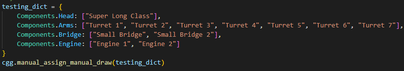

### Convert your Python class to battleship designs! 

Sample converted from a linear classifier with log loss: 

A specific input format (below) is required for now, but soon*tm it will be able to convert straight from a .py file. I hope. 

See main from [class_gui_generator.py](class_gui_generator.py) for details on customized inputs. 